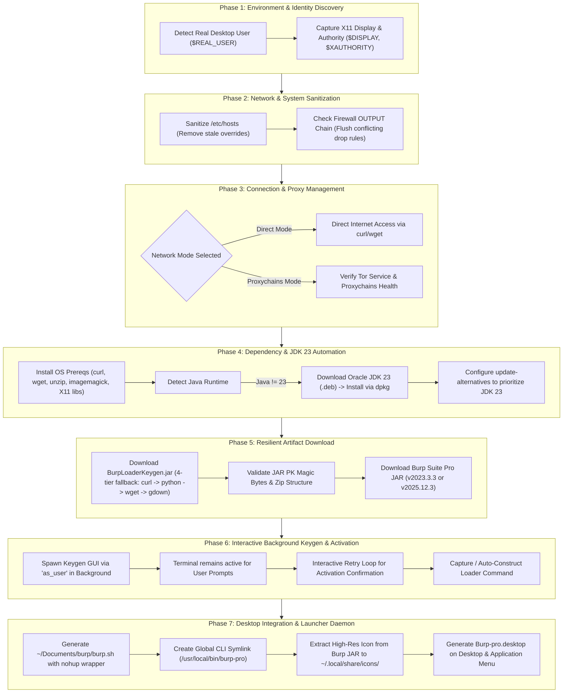

# 🚀 Burp Suite Professional — Universal Setup, Launcher & Technical Guide

<div align="center">

[](https://www.kali.org/)
[](https://www.oracle.com/java/)
[](https://www.gnu.org/software/bash/)
[](https://portswigger.net/burp)
[](LICENSE)

**An enterprise-grade Bash automation installer, desktop launcher generator, and complete operational guide for setting up Burp Suite Professional on modern Linux distributions.**

[✨ Features](#-features) • [🔬 What the Script Does](#-under-the-hood-what-the-setup-script-does) • [⚡ Automated Setup](#-method-1-automated-1-click-installation-recommended) • [📖 Manual Setup](#-method-2-complete-manual-step-by-step-guide) • [🔑 Activation Guide](#-activation-walkthrough) • [🛠️ Usage](#-how-to-launch-burp-suite-pro) • [❓ Troubleshooting](#-troubleshooting--faq)

</div>

---

## 📑 Table of Contents

- [✨ Features](#-features)
- [🔬 Under the Hood: What the Setup Script Does](#-under-the-hood-what-the-setup-script-does)
  - [Architectural Execution Pipeline](#1-architectural-execution-pipeline)
  - [Phase-by-Phase Technical Deep Dive](#2-phase-by-phase-technical-deep-dive)
  - [System Modifications & Files Created](#3-system-modifications--files-created)
  - [Security & Permission Architecture](#4-security--permission-architecture)
- [📋 System Requirements & Compatibility](#-system-requirements--compatibility)
- [🚀 Method 1: Automated 1-Click Installation (Recommended)](#-method-1-automated-1-click-installation-recommended)
  - [Step 1: Clone Repository](#1-clone-or-download-the-repository)
  - [Step 2: Set Execution Permissions](#2-set-execution-permissions)
  - [Step 3: Run Installer](#3-run-the-installer-script)
- [📖 Method 2: Complete Manual Step-by-Step Guide](#-method-2-complete-manual-step-by-step-guide)
  - [Step 1: Install & Configure Oracle JDK 23](#step-1--install--configure-oracle-jdk-23)
  - [Step 2: Prepare Directories & Download JARs](#step-2--prepare-directory--download-burp-suite--keygen)
  - [Step 3: Launch Keygen & Offline Activation](#step-3--launch-keygen--activate-burp-suite)
  - [Step 4: Create Startup Script, Symlink & Desktop Shortcut](#step-4--create-startup-script-symlink--desktop-shortcut)
- [🔑 Activation Walkthrough](#-activation-walkthrough)
- [🖥️ How to Launch Burp Suite Pro](#-how-to-launch-burp-suite-pro)
- [📁 Repository & Directory Layout](#-repository--directory-layout)
- [🔍 Verification & Diagnostics](#-verification--diagnostics)
- [⚙️ Advanced JVM Configuration & Performance Tuning](#-advanced-jvm-configuration--performance-tuning)
- [❓ Troubleshooting & FAQ](#-troubleshooting--faq)
- [📜 Disclaimer & License](#-disclaimer)

---

## ✨ Features

- ☕ **Automated Oracle JDK 23 Pipeline**: Checks existing Java runtimes, downloads Oracle JDK 23 (`jdk-23.0.2_linux-x64_bin.deb`), registers it with `update-alternatives`, and validates the active version.
- 🌐 **Dual Network Routing Modes**: Choose between high-speed direct downloads or automated Tor / Proxychains routing with built-in Tor status detection.
- 🔄 **Resilient Multi-Engine Fallback Downloader**: Robust download engine combining `curl` (custom browser UA), Python 3 `urllib` (with Google Drive cookie/token extraction), `wget`, and `gdown`.
- 🪟 **Persistent Background GUI Execution**: Spawns GUI tools (Keygen) in the background with user permissions (`$REAL_USER`) so the window remains open while allowing terminal interaction.
- ⚡ **Detached Daemon Startup Script (`nohup`)**: Generates an optimized `~/Documents/burp/burp.sh` script that runs completely detached in the background without locking your terminal.
- 💻 **Global CLI Integration (`burp-pro`)**: Automatically sets up `/usr/local/bin/burp-pro` for instant launching from anywhere in the system.
- 🎯 **Seamless Desktop Launcher**: Automatically extracts the official high-resolution icon from the Burp JAR file and creates an integrated desktop application launcher (`Burp-pro.desktop`) for GNOME, XFCE, KDE, and Cinnamon.
- 🛡️ **Network & System Safeguards**: Automatically checks for and cleans up lingering `/etc/hosts` overrides or custom firewall drop rules.

---

## 🔬 Under the Hood: What the Setup Script Does

The setup script (`burpsuite_setup--Ver-06.sh`) is an automated system configuration and deployment engine designed to take a bare Linux installation and configure a fully operational, desktop-integrated Burp Suite Professional environment.

Here is the exact technical breakdown of what happens when the script runs:

### 1. Architectural Execution Pipeline



---

### 2. Phase-by-Phase Technical Deep Dive

#### 🔹 Phase 1: Real User & Display Session Resolution
- **Problem**: When running `sudo bash script.sh`, standard environment variables like `$HOME`, `$USER`, and `$DISPLAY` point to `root` or become inaccessible. This causes downloaded files to be owned by `root:root` and GUI windows to fail with `Cannot open display :0`.
- **Script Solution**:
  - Automatically identifies the true logged-in desktop user using `$SUDO_USER` and `getent passwd`.
  - Captures the real user's home directory (`$REAL_HOME`), display server (`$REAL_DISPLAY`), and X11 authority cookie (`$XAUTHORITY`).
  - Employs an internal wrapper function `as_user()` that drops privileges to execute GUI tasks and file creations as the desktop user.

#### 🔹 Phase 2: Network State Inspection & Sanitation
- **Problem**: Leftover configuration from previous installations or test setups can artificially block connections to PortSwigger servers via DNS poisoning in `/etc/hosts` or drop rules in `iptables`.
- **Script Solution**:
  - Scans `/etc/hosts` for artificial overrides targeting `portswigger.net` or `burpsuite.net` and safely cleans them.
  - Inspects the `iptables` `OUTPUT` filter chain and removes stale drop rules targeting PortSwigger IP addresses.

#### 🔹 Phase 3: Proxychains & Network Routing Preference
- **Features**:
  - Detects if `proxychains4` or `proxychains` is present on the machine.
  - Offers a choice between **Direct Connection** (fastest, unthrottled) and **Proxychains Mode** (routes all traffic through SOCKS/Tor).
  - If Proxychains is selected, it checks whether `tor.service` is running via `systemctl`, offers to start it automatically, and tests end-to-end connectivity with a lightweight probe request.

#### 🔹 Phase 4: Dependency Provisioning & JDK 23 Setup
- **OS Abstraction**: Automatically detects package managers (`apt-get`, `dnf`, `pacman`) and installs required libraries: `wget`, `curl`, `ca-certificates`, `unzip`, `python3-pip`, `imagemagick`, and X11 rendering libraries (`libxrender1`, `libxtst6`, `libxi6`).
- **Java Configuration**:
  - Checks if Java 23 is already active.
  - If not found, downloads Oracle JDK 23 (`jdk-23.0.2_linux-x64_bin.deb`) directly from Oracle's archive into `~/java/`.
  - Installs via `dpkg -i` and registers the binary with `update-alternatives --set java`.

#### 🔹 Phase 5: Resilient 4-Tier Download Engine
- Downloads `BurpLoaderKeygen.jar` and `burpsuite_pro_v*.jar` into `~/Documents/burp/`.
- **Multi-Method Fallback**:
  1. **Method 1 (`curl`)**: Uses custom Mozilla browser User-Agent headers and connection limits.
  2. **Method 2 (`Python urllib`)**: Implements an in-memory HTTP cookie jar to parse Google Drive's large-file confirmation tokens (`confirm=xxxx`) automatically.
  3. **Method 3 (`wget`)**: Handles session cookies via `--save-cookies` and `--keep-session-cookies`.
  4. **Method 4 (`gdown`)**: Invokes python `gdown` with fuzzy URL parsing.
- **Integrity Validation**: Runs `is_valid_jar` helper to verify that downloaded files have the standard ZIP `PK` header signature and pass `unzip -t` verification before proceeding.

#### 🔹 Phase 6: Background GUI Keygen & Activation Workflow
- Launches `BurpLoaderKeygen.jar` as a background process (`&`) using `as_user` with modern Java 23 JVM module flags:
  ```bash
  --add-opens=java.base/java.lang=ALL-UNNAMED --add-opens=java.desktop/javax.swing=ALL-UNNAMED
  ```
- **Key Advantage**: The Keygen window appears immediately on screen and **remains open**, while the terminal remains interactive and asks you to confirm once activation is finished.
- Includes an interactive retry loop allowing you to re-launch the Keygen at any time if needed.
- Prompts for the custom **Loader Command** from the Keygen window or auto-generates the optimized standard string.

#### 🔹 Phase 7: Daemonization & Desktop Integration
- **Startup Wrapper (`burp.sh`)**: Creates `~/Documents/burp/burp.sh` containing:
  ```bash
  #!/bin/bash
  nohup <Loader Command> >/dev/null 2>&1 &
  ```
  This allows Burp Suite to start completely decoupled from any terminal session.
- **CLI Symlink**: Links `burp.sh` to `/usr/local/bin/burp-pro` so you can type `burp-pro` in any shell.
- **Icon Extraction**: Uses `unzip -p` to extract the official high-resolution `icon64.png` from inside the Burp Suite JAR directly to `~/.local/share/icons/burpsuite.png`.
- **Desktop Entry**: Creates an XDG-compliant `Burp-pro.desktop` entry on `~/Desktop` and registers it in `~/.local/share/applications/` with `StartupWMClass=burp-StartBurp`.

---

### 3. System Modifications & Files Created

| Path / Target | Action | Purpose | Ownership / Permissions |
| :--- | :--- | :--- | :--- |
| `~/java/jdk-23.0.2_linux-x64_bin.deb` | Created | Oracle JDK 23 Debian installation package | `$REAL_USER` (rw-r--r--) |
| `/usr/lib/jvm/jdk-23...` | Installed | Oracle JDK 23 system binaries | `root:root` (rwxr-xr-x) |
| `/etc/alternatives/java` | Modified | Points default system Java runtime to JDK 23 | Symlink |
| `~/Documents/burp/` | Created | Dedicated workspace directory for Burp Pro | `$REAL_USER` (rwxr-xr-x) |
| `~/Documents/burp/BurpLoaderKeygen.jar` | Created | Loader and activation keygen utility | `$REAL_USER` (rw-r--r--) |
| `~/Documents/burp/burpsuite_pro_v*.jar` | Created | Official standalone Burp Suite Professional JAR | `$REAL_USER` (rw-r--r--) |
| `~/Documents/burp/burp.sh` | Created | Background launch wrapper with `nohup` | `$REAL_USER` (rwxr-xr-x) |
| `/usr/local/bin/burp-pro` | Created | Global system CLI symlink pointing to `burp.sh` | Symlink to `burp.sh` |
| `~/.local/share/icons/burpsuite.png` | Created | Extracted official Burp Suite application icon | `$REAL_USER` (rw-r--r--) |
| `~/Desktop/Burp-pro.desktop` | Created | Desktop shortcut launcher | `$REAL_USER` (rwxr-xr-x) |
| `~/.local/share/applications/Burp-pro.desktop` | Created | System Application Menu launcher entry | `$REAL_USER` (rwxr-xr-x) |
| `/etc/hosts` | Sanitized | Cleans conflicting PortSwigger IP overrides | `root:root` |

---

### 4. Security & Permission Architecture

```
                               ┌──────────────────────────┐
                               │  sudo bash setup.sh      │ (EUID=0, Root)
                               └────────────┬─────────────┘
                                            │
                    ┌───────────────────────┴───────────────────────┐
                    ▼                                               ▼
     [ System Level Tasks ]                          [ User Level Tasks ]
     • dpkg -i jdk-23.deb                            • Executed via as_user()
     • update-alternatives                           • ~/Documents/burp/ files
     • /usr/local/bin/burp-pro symlink               • ~/Desktop/Burp-pro.desktop
     • apt-get dependencies                          • GUI Keygen with X11 auth
     (Root Ownership)                                (Owned by $REAL_USER)
```

- **No Root File Hijacking**: Everything in your home directory is owned by your standard user account (`$REAL_USER`), eliminating permission errors when modifying configs or launching Burp later.
- **X11 Display Passthrough**: GUI windows inherit your active desktop session without triggering display errors.

---

## 📋 System Requirements & Compatibility

| Distribution | Compatibility | Package Manager | Recommended Desktop Environments |
| :--- | :---: | :---: | :--- |
| **Kali Linux** (2022.x - 2025.x) | 🟢 Fully Tested | `apt` / `dpkg` | XFCE, GNOME, KDE Plasma |
| **Debian** (11 Bullseye / 12 Bookworm) | 🟢 Fully Tested | `apt` / `dpkg` | GNOME, XFCE |
| **Ubuntu** (20.04 / 22.04 / 24.04 LTS) | 🟢 Fully Tested | `apt` / `dpkg` | GNOME |
| **Fedora** / **RHEL** | 🟡 Compatible | `dnf` / `rpm` | GNOME, KDE |
| **Arch Linux** / **Manjaro** | 🟡 Compatible | `pacman` | Any |

> [!NOTE]
> - **Architecture**: `x86_64` / `amd64` (Required for Oracle JDK 23 `.deb` package).
> - **Privileges**: Standard user account with `sudo` access.

---

## 🚀 Method 1: Automated 1-Click Installation (Recommended)

Follow these simple steps to run the complete automated setup script.

### 1. Clone or Download the Repository
```bash
git clone https://github.com/your-username/burpsuite-pro-setup.git
cd burpsuite-pro-setup
```

### 2. Set Execution Permissions
```bash
chmod +x burpsuite_setup--Ver-06.sh
```

### 3. Run the Installer Script
```bash
sudo bash burpsuite_setup--Ver-06.sh
```

### What happens during installation:
1. **Network Selection**: Choose **Direct Connection** (`1`) or **Proxychains Mode** (`2`).
2. **JDK 23 Setup**: Installs and sets Oracle JDK 23 as the system default.
3. **Version Selection**: Choose your preferred Burp Suite Pro version:
   - `1` : **v2023.3.3** *(Recommended — highest loader compatibility)*
   - `2` : **v2025.12.3** *(Latest release)*
4. **Keygen & Activation**: The Keygen GUI opens automatically in the background. Follow the on-screen prompts (see [Activation Walkthrough](#-activation-walkthrough)).
5. **Launcher Creation**: The script outputs `/usr/local/bin/burp-pro` and a desktop shortcut.

---

## 📖 Method 2: Complete Manual Step-by-Step Guide

If you prefer to configure everything manually without running the automated script, follow this exact step-by-step procedure:

### Step 1 — Install & Configure Oracle JDK 23

1. **Download Oracle JDK 23 Debian Package**:
   ```bash
   cd ~ && mkdir -p java && cd java
   wget https://download.oracle.com/java/23/archive/jdk-23.0.2_linux-x64_bin.deb
   ```

2. **Install the Package**:
   ```bash
   sudo dpkg -i jdk-23.0.2_linux-x64_bin.deb
   sudo apt-get install -f -y
   ```

3. **Configure Java Alternatives**:
   ```bash
   sudo update-alternatives --config java
   ```
   *Select the number corresponding to **Oracle JDK 23** or **jdk-23** from the list.*

4. **Verify Active Java Runtime**:
   ```bash
   java --version
   ```
   *Output must confirm Java 23 (e.g., `java 23.0.2 2025-01-21`).*

---

### Step 2 — Prepare Directory & Download Burp Suite + Keygen

1. **Create Working Directory**:
   ```bash
   mkdir -p ~/Documents/burp && cd ~/Documents/burp
   ```

2. **Download `BurpLoaderKeygen.jar`**:
   - Download the loader/keygen file from Google Drive:
     ```bash
     wget --no-check-certificate "https://drive.google.com/uc?export=download&id=1dr9212KN-PoYPAWI9pNa732JsvfrnDSz" -O BurpLoaderKeygen.jar
     ```
   - *If direct download fails, open the link in your browser:*
     `https://drive.google.com/file/d/1dr9212KN-PoYPAWI9pNa732JsvfrnDSz/view?usp=sharing`
     *and save the file as `~/Documents/burp/BurpLoaderKeygen.jar`.*

3. **Download Burp Suite Professional JAR**:

   - **Option A: Version 2023.3.3 (Recommended)**:
     ```bash
     wget "https://portswigger.net/burp/releases/download?product=pro&version=2023.3.3&type=Jar" -O burpsuite_pro_v2023.3.3.jar
     ```

   - **Option B: Version 2025.12.3 (Latest)**:
     ```bash
     wget "https://portswigger.net/burp/releases/download?product=pro&version=2025.12.3&type=Jar" -O burpsuite_pro_v2025.12.3.jar
     ```

---

### Step 3 — Launch Keygen & Activate Burp Suite

1. **Run Keygen**:
   ```bash
   cd ~/Documents/burp
   java --add-opens=java.base/java.lang=ALL-UNNAMED --add-opens=java.desktop/javax.swing=ALL-UNNAMED -jar BurpLoaderKeygen.jar
   ```

2. **Perform Activation**:
   - In the Keygen window:
     1. Change the **License Name** if desired (e.g., `Pentester`).
     2. Copy the **License Key** string.
     3. Click the **`[ Run ]`** button inside the Keygen window to launch Burp Suite.
   - In the Burp Suite window:
     1. Paste the copied **License Key** and click **`[ Next ]`**.
     2. When prompted for activation method, select **`[ Manual Activation ]`**.
     3. Click **`[ Copy Request ]`**.
   - Back in Keygen:
     1. Paste the request into the **`Activation Request`** box.
     2. The **`Activation Response`** will be generated automatically. Copy it.
   - Back in Burp Suite:
     1. Paste into the **`Activation Response`** box and click **`[ Next ]`**.
     2. Click **`[ Finish ]`**. Burp Suite Pro is now activated!

3. **Copy the Loader Command**:
   - In the Keygen window, look at the **Loader Command** field at the top and copy the entire string (e.g., `/usr/lib/jvm/jdk-23.../bin/java --add-opens=... -javaagent:BurpLoaderKeygen.jar -jar burpsuite_pro_v2023.3.3.jar`).

---

### Step 4 — Create Startup Script, Symlink & Desktop Shortcut

1. **Create `~/Documents/burp/burp.sh`**:
   ```bash
   cat << 'EOF' > ~/Documents/burp/burp.sh
   #!/bin/bash
   BURP_DIR="$HOME/Documents/burp"
   cd "$BURP_DIR" || exit 1
   nohup java --add-opens=java.base/java.lang=ALL-UNNAMED --add-opens=java.desktop/javax.swing=ALL-UNNAMED -javaagent:"$BURP_DIR/BurpLoaderKeygen.jar" -jar "$BURP_DIR/burpsuite_pro_v2023.3.3.jar" >/dev/null 2>&1 &
   EOF
   ```
   *(Replace `burpsuite_pro_v2023.3.3.jar` with `burpsuite_pro_v2025.12.3.jar` if you downloaded the newer version).*

2. **Make it Executable**:
   ```bash
   chmod +x ~/Documents/burp/burp.sh
   ```

3. **Create Global Command (`burp-pro`)**:
   ```bash
   sudo ln -sf ~/Documents/burp/burp.sh /usr/local/bin/burp-pro
   ```

4. **Extract Icon & Create Desktop Launcher**:
   ```bash
   # Extract official icon
   mkdir -p ~/.local/share/icons
   unzip -p ~/Documents/burp/burpsuite_pro_*.jar "resources/Media/icon64.png" > ~/.local/share/icons/burpsuite.png 2>/dev/null || true

   # Create desktop entry
   mkdir -p ~/Desktop ~/.local/share/applications
   cat << EOF > ~/Desktop/Burp-pro.desktop
   [Desktop Entry]
   Version=1.0
   Type=Application
   Name=Burp-pro
   GenericName=BurpSuite Professional
   Comment=Web Application Security Testing Suite
   Exec=$HOME/Documents/burp/burp.sh
   Icon=$HOME/.local/share/icons/burpsuite.png
   Terminal=false
   Categories=Security;Network;Development;
   Keywords=burpsuite;security;web;proxy;pentest;
   StartupNotify=true
   StartupWMClass=burp-StartBurp
   EOF

   chmod +x ~/Desktop/Burp-pro.desktop
   cp ~/Desktop/Burp-pro.desktop ~/.local/share/applications/Burp-pro.desktop
   ```

---

## 🔑 Activation Walkthrough

Follow this step-by-step visual sequence to activate Burp Suite:

```
┌──────────────────────────────────────────────────────────────────────────┐
│                           KEYGEN GUI WINDOW                              │
│                                                                          │
│  Loader Command: [ java --add-opens=... -javaagent:BurpLoader... ]       │
│  License Text  : [ Licensed to Pentester ]   [ Copy Key ] <── (Step 1)   │
│                                              [   RUN    ] <── (Step 2)   │
│                                                                          │
│  Activation Request:  [ Paste Request from Burp Here ]    <── (Step 5)   │
│  Activation Response: [ Copy Auto-Generated Response ]    ─── (Step 6) ─┐│
└─────────────────────────────────────────────────────────────────────────│┘
                                                                          │
      ┌───────────────────────────────────────────────────────────────────┘
      ▼
┌──────────────────────────────────────────────────────────────────────────┐
│                         BURPSUITE PRO WINDOW                             │
│                                                                          │
│  1. Paste License Key ──> Click [ Next ]                                 │
│  2. Choose [ Manual Activation ]                                         │
│  3. Click [ Copy Request ] ──> (Paste into Keygen Request Box)           │
│  4. Paste Response from Keygen ──> Click [ Next ]                        │
│  5. Click [ Finish ] 🎉 Activation Complete!                            │
└──────────────────────────────────────────────────────────────────────────┘
```

> [!TIP]
> Always make sure to keep the Keygen window open until you copy the **Loader Command** and test your startup script.

---

## 🖥️ How to Launch Burp Suite Pro

Once installed, you can launch Burp Suite Professional using any of the following methods:

### Method 1: Terminal Command (Anywhere)
```bash
burp-pro
```
*The process will automatically detach and run quietly in the background, leaving your terminal free for other commands.*

### Method 2: Desktop Shortcut
- Double click the **Burp-pro** icon on your Desktop.

### Method 3: Application Launcher Menu
- Open your system's application menu (press Super / Windows key) and search for **`Burp-pro`**.

---

## 📁 Repository & Directory Layout

```
├── burpsuite_setup--Ver-06.sh      # Latest automated setup script (Recommended)
├── burpsuite_setup--Ver-05.sh      # Previous stable script version
├── instuctions.txt                 # Quick reference manual notes
├── README.md                       # Comprehensive documentation & guide
└── LICENSE                         # Project License
```

### Installed Files on Your System:
```
~/
├── java/
│   └── jdk-23.0.2_linux-x64_bin.deb   # Oracle JDK 23 installer
├── Documents/
│   └── burp/
│       ├── BurpLoaderKeygen.jar       # Loader & Keygen utility
│       ├── burpsuite_pro_v*.jar       # Burp Suite Pro standalone JAR
│       └── burp.sh                    # Detached startup execution script
├── Desktop/
│   └── Burp-pro.desktop               # Desktop launcher
└── .local/share/
    ├── icons/burpsuite.png            # Extracted application icon
    └── applications/Burp-pro.desktop  # App Menu integration
```

---

## 🔍 Verification & Diagnostics

Run these commands to verify that your environment is properly configured:

```bash
# 1. Check current default Java version (must be Java 23)
java --version

# 2. Check installed Burp Suite files & sizes
ls -lh ~/Documents/burp/

# 3. Test execution script
bash ~/Documents/burp/burp.sh

# 4. Verify CLI symlink
ls -l /usr/local/bin/burp-pro

# 5. Check Desktop launcher permissions
ls -l ~/Desktop/Burp-pro.desktop
```

---

## ⚙️ Advanced JVM Configuration & Performance Tuning

To customize memory limits or GUI scaling, edit `~/Documents/burp/burp.sh`:

```bash
nano ~/Documents/burp/burp.sh
```

### Recommended JVM Flags:
```bash
#!/bin/bash
BURP_DIR="$HOME/Documents/burp"
cd "$BURP_DIR" || exit 1

nohup java \
  -Xmx4g \
  -XX:+UseG1GC \
  -Dsun.java2d.uiScale=1.0 \
  --add-opens=java.base/java.lang=ALL-UNNAMED \
  --add-opens=java.desktop/javax.swing=ALL-UNNAMED \
  -javaagent:"$BURP_DIR/BurpLoaderKeygen.jar" \
  -jar "$BURP_DIR/burpsuite_pro_v2023.3.3.jar" >/dev/null 2>&1 &
```

| Flag | Purpose |
| :--- | :--- |
| `-Xmx4g` | Allocates a maximum of **4 GB RAM** to Burp Suite (increase to `-Xmx8g` for large scan scopes). |
| `-XX:+UseG1GC` | Enables Garbage-First Collector for lower latency during heavy web scanning. |
| `-Dsun.java2d.uiScale=2.0` | Enables **2x High-DPI UI scaling** for 2K/4K displays. |

---

## ❓ Troubleshooting & FAQ

<details>
<summary><b>1. Proxychains fails with <code>SOCKS connection failed</code> or timeouts</b></summary>

- **Root Cause**: The Tor background service is not running on your machine.
- **Solution**:
  1. Start the Tor service:
     ```bash
     sudo systemctl start tor
     ```
  2. Verify Tor is active:
     ```bash
     sudo systemctl status tor
     ```
  3. Alternatively, re-run the setup script and select **Option 1 (Direct Connection)**.
</details>

<details>
<summary><b>2. Desktop shortcut does not open when clicked</b></summary>

- **Root Cause**: Modern GNOME/XFCE desktops require desktop files to be explicitly trusted.
- **Solution**:
  ```bash
  gio set ~/Desktop/Burp-pro.desktop metadata::trusted true
  chmod +x ~/Desktop/Burp-pro.desktop
  ```
  *On XFCE / Kali Linux, right-click the Desktop icon and select **Allow Launching**.*
</details>

<details>
<summary><b>3. <code>java.awt.HeadlessException</code> or No Display Found</b></summary>

- **Root Cause**: Running GUI commands as `root` via `sudo` without sharing the X11 display session.
- **Solution**:
  Allow local root connections to your X11 display server:
  ```bash
  xhost +local:root
  ```
  *The automated setup script handles this automatically via `$REAL_USER` impersonation.*
</details>

<details>
<summary><b>4. Java version is not 23 after installation</b></summary>

- **Root Cause**: Another Java version (e.g. OpenJDK 17 or 21) has a higher priority in alternatives.
- **Solution**:
  ```bash
  sudo update-alternatives --config java
  ```
  *Enter the selection number corresponding to `/usr/lib/jvm/jdk-23...` and press ENTER.*
</details>

<details>
<summary><b>5. <code>BurpLoaderKeygen.jar</code> download fails or is 0 bytes</b></summary>

- **Root Cause**: Google Drive rate-limits direct unauthenticated downloads.
- **Solution**:
  1. Open [Google Drive Download Link](https://drive.google.com/file/d/1dr9212KN-PoYPAWI9pNa732JsvfrnDSz/view?usp=sharing) in your web browser.
  2. Click **Download**.
  3. Move the downloaded file into `~/Documents/burp/BurpLoaderKeygen.jar`.
  4. Run `burp-pro` or re-run the script.
</details>

---

## 🤝 Contributing

Contributions, issues, and feature suggestions are welcome!
Feel free to check the [issues page](https://github.com/your-username/burpsuite-pro-setup/issues).

1. Fork the Project
2. Create your Feature Branch (`git checkout -b feature/AmazingFeature`)
3. Commit your Changes (`git commit -m 'Add some AmazingFeature'`)
4. Push to the Branch (`git push origin feature/AmazingFeature`)
5. Open a Pull Request

---

## 📜 Disclaimer

> [!CAUTION]
> **Educational and Authorized Testing Only**: This repository and script are provided strictly for educational purposes, security research, and authorized penetration testing. Ensure you possess proper authorization before conducting security assessments on any system or web application. Always comply with software licensing agreements and PortSwigger terms of service.

---

<div align="center">

Made with ❤️ for the Cybersecurity & Penetration Testing Community

</div>
